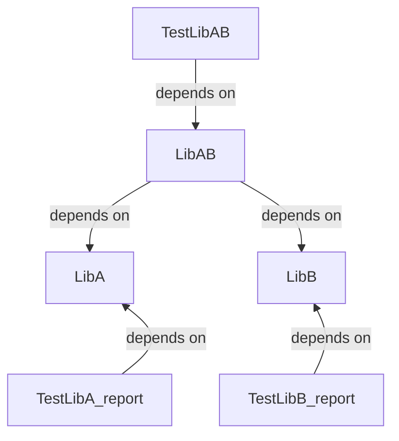

# Simple test caching setup

One of the most confortable build experience is:
```shell
[build] ninja: no work to do.
```

Caching and detection of what needs and needs not to be rebuild is a core mechanism of build systems since Make. However, we often do not apply such features to a major part of the build process: running tests. When deterministic, however, there is no reason test run cannot be treated just like a compilation phase, a build target producing a test output from a test executable, and possibly some test data.

This repository is a minimalist example of this technique, of course much lighter and less featurefull than tools that integrate this feature and much more such as Bazel.

```shell
$ cmake --preset ninja-clang .
...
Build files have been written to: .../build

# Run test build once
$ cmake --build --preset ninja-clang-relWithDebInfo --target AllTests
Running main() from .../googletest-src/googletest/src/gtest_main.cc
[==========] Running 1 test from 1 test suite.
[----------] Global test environment set-up.
[----------] 1 test from TestAB
[ RUN      ] TestAB.AB
[       OK ] TestAB.AB (0 ms)
[----------] 1 test from TestAB (0 ms total)

[----------] Global test environment tear-down
[==========] 1 test from 1 test suite ran. (0 ms total)
[  PASSED  ] 1 test.
[9/10] Generating AllTests/RelWithDebInfo/TestLibAB_report.json
Running main() from .../googletest-src/googletest/src/gtest_main.cc
[==========] Running 1 test from 1 test suite.
[----------] Global test environment set-up.
[----------] 1 test from TestAB
[ RUN      ] TestAB.AB
[       OK ] TestAB.AB (0 ms)
[----------] 1 test from TestAB (0 ms total)

[----------] Global test environment tear-down
[==========] 1 test from 1 test suite ran. (0 ms total)
[  PASSED  ] 1 test.
[10/10] Generating AllTests/RelWithDebInfo/TestLibB_report.json
Running main() from .../googletest-src/googletest/src/gtest_main.cc
[==========] Running 1 test from 1 test suite.
[----------] Global test environment set-up.
[----------] 1 test from TestAB
[ RUN      ] TestAB.AB
[       OK ] TestAB.AB (0 ms)
[----------] 1 test from TestAB (0 ms total)

[----------] Global test environment tear-down
[==========] 1 test from 1 test suite ran. (0 ms total)
[  PASSED  ] 1 test.


# Run Again
$ cmake --build --preset ninja-clang-relWithDebInfo --target AllTests
ninja: no work to do.
```

Just like any other target, when you modify a source, only it's dependencies tests are re-run. The dependencies of this project are as follow:



so for example, modifying something in LibB will trigger the TestLibB and TestLibAB but not TestLibA.
